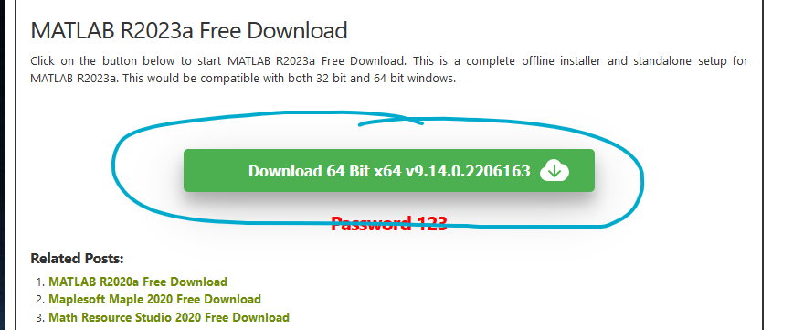

# college-softwares

## Multisim Installation
1. Extract the rar file
2. Open the .iso file inside the extracted folder
3. Open the `Install.exe` file to install
4. Use the `NI License Activator 1.2.exe` and activate the Base Edition
5. Enjoy :>


## MATLAB Installation
1. Copy this link
   ```
   https://88-99-61-21.top/Getintopc.com/MathWorks_MATLAB_R2023a_v9.14.0.2206163.rar?md5=gCVVBPuIQxyjKC77lPRW0g&expires=1712147106
   ```
3. Paste the link in a new tab and download the file
4. Extract the files
5. Follow the instructions in `Readme.txt` in the `Crack` folder

> If the link does not work, go to this [site]([https://getintopc.com/softwares/maths/matlab-r2023a-free-download-9038393/](https://getintopc.com/softwares/maths/matlab-r2024a-free-download/)) and click this button to download the file
> 

